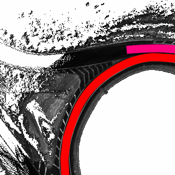
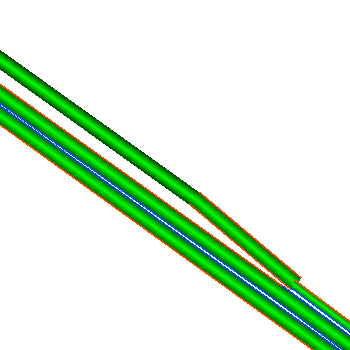
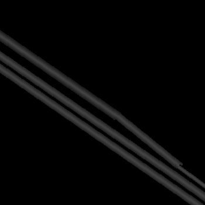

<!-- Table of contents generated by http://tableofcontent.eu/ -->
- [Road Mapper Module](#road-mapper-module)
- [Description](#description)
- [Saving Remission Map Images](#saving-remission-map-images)
- [Splitting the Remission Map Images](#splitting-the-remission-map-images)
- [Rules for Ground Truth Annotations on Remission Map Images](#rules-for-ground-truth-annotations-on-remission-map-images)
- [Generating Road Maps from Annotated SVG Files](#generating-road-maps-from-annotated-svg-files)
- [Visualizing a Road Map](#visualizing-a-road-map)
	- [Examples](#examples)
- [Road Mapper Sampling](#road-mapper-sampling)
	- [Examples](#examples-1)
- [Training the Neural Network](#training-the-neural-network)
	- [Tutorial on How to Train and Test ENet on LCAD Road Remission dataset](#tutorial-on-how-to-train-and-test-enet-on-lcad-road-remission-dataset)
		- [Installation](#installation)
		- [Preparation](#preparation)
		- [Training ENet](#training-enet)
			- [Let's Start With the Encoder Training](#lets-start-with-the-encoder-training)
			- [After the Encoder-Training is Finished you can Continue with the Training of Encoder + Decoder](#after-the-encoder-training-is-finished-you-can-continue-with-the-training-of-encoder-decoder)
		- [Testing ENet](#testing-enet)
		- [Visualize the Prediction](#visualize-the-prediction)
			- [Python Code](#python-code)
			- [C++ Code](#c-code)
			- [Examples](#examples-2)
		- [Measurement of Execution Time](#measurement-of-execution-time)

# Road Mapper Module

## Description

The Road Mapper module handles the *map_type* CARMEN_ROAD_MAP_v (prefix character 'r'), the data structure *road_prob* and the map server message CARMEN_MAP_SERVER_ROAD_MAP_NAME. Each cell in a road gridmap contains the following data:
```c
 typedef struct				/* Probabilities of a pixel in the road map */
 {
   unsigned short off_road;		/* Probability of being off the road */
   unsigned short solid_marking;	/* Probability of being in a lane solid marking */
   unsigned short broken_marking;	/* Probability of being in a lane broken marking */
   unsigned short lane_center;		/* Probability of being at the center of a lane */
 } road_prob;
```
The following color code is adopted for displaying a road map:
  -  = off the road
  -  = solid marking
  -  = broken marking
  -  = center of a lane

The Road Mapper module parameters can be found at [carmen-ford-escape.ini](../carmen-ford-escape.ini) and are the following:
```ini
 # Road Mapper

 road_mapper_sample_width		120	# pixels
 road_mapper_sample_height		120	# pixels
 road_mapper_distance_sample		5.0	# meters
 road_mapper_distance_offset		0.5	# meters
 road_mapper_n_offset			3	# n shifts to the left and n shifts to the right
 road_mapper_n_rotation			24	# delta = (360 degrees / n_rotation) degrees
 road_mapper_out_path			$CARMEN_HOME/data/road_mapper  		# out path for generated sample files
 road_mapper_out_path_remission		$CARMEN_HOME/data/road_mapper_remission # out path for generated remission files
 road_mapper_image_channels		1	# road map sample image pixel may have either 1 (B&W) or 3 channels (BGR)
 road_mapper_image_class_bits		4	# road map sample image pixel class may have 0 to 6 precision bits (B&W) or 1 to 8 precision bits (BGR)
 road_mapper_remission_image_channels	3	# remission map sample image pixel may have either 1 (B&W) or 3 channels (BGR) 
```

## Saving Remission Map Images

To save the remission map images please do the following:

First step:
Open a terminal tab on the carmen_lcad/bin directory and run:
```bash
 $ ./central
```
Second step:
Open another terminal tab on the carmen_lcad/bin directory and run the proccontrol program with the following .ini file [process-ida_a_guarapari_playback_road_mapper_save_remission_map_images.ini](../../bin/process-ida_a_guarapari_playback_road_mapper_save_remission_map_images.ini):
```bash
 $ ./proccontrol process-ida_a_guarapari_playback_road_mapper_save_remission_map_images.ini
```

## Splitting the Remission Map Images

To split the remission map images to ground truth annotation please do the following:

First step:
Open a terminal tab on this directory and create a list of the remission map images:
```bash
 $ ls ../../data/road_mapper_remission/*.png > remission_map_images.txt
```
Second step:
Run the [road_mapper_image_splitter.cpp](road_mapper_image_splitter.cpp) program:
```bash
 $ ./road_mapper_image_splitter 3 3 remission_map_images.txt ../../data/road_mapper_remission_350px/
```
To learn more about the parameters please look at [road_mapper_image_splitter.cpp](road_mapper_image_splitter.cpp)

## Rules for Ground Truth Annotations on Remission Map Images

1. Use [**Inkscape**](https://inkscape.org/en/download) to draw a polyline all the way along the center of each road lane.
2. Place both the start and finish points out of the image limits, in order to provide a better fit for each polyline.
3. Place the start point of each polyline in such a way that lane orientation matches the direction from the start point to the finish point.
4. If two polylines either cross, merge or fork, then make sure to draw the *"main"* polyline before the secondary. 
5. Make each point of the polyline auto-smooth, in order to generate a cubic Bezier curve.
6. Set each polyline stroke width properly, in order to fulfill each road lane and touch the borders of the neighbor lanes.
7. Select each line stroke paint color according to the following code:
  -  RGB(255, 000, 000) = #ff0000 = single line marking on both lane sides.
  -  RGB(255, 000, 127) = #ff007f = single line marking on the right side and broken line marking on the left side.
  -  RGB(127, 000, 255) = #7f00ff = broken line marking on the right side and single line marking on the left side.
  -  RGB(000, 000, 255) = #0000ff = broken line marking on both lane sides.
  -  RGB(000, 255, 000) = #00ff00 = no line marking on both lane sides
  -  RGB(255, 127, 000) = #ff7f00 = single line marking on the right side and no line marking on the left side.
  -  RGB(127, 255, 000) = #7fff00 = no line marking on the right side and single line marking on the left side.
  -  RGB(000, 127, 255) = #007fff = broken line marking on the right side and no line marking on the left side.
  -  RGB(000, 255, 127) = #00ff7f = no line marking on the right side and broken line marking on the left side.
8. Save the Inkscape SVG file with same image name.

*R.Carneiro:	from i7726530_-353710.png to i7758030_-363790.png*

*R.Nascimento:	from i7705530_-338310.png to i7726460_-353990.png*

## Generating Road Maps from Annotated SVG Files

To generate the road maps from the svg files please do the following:

First step:
Create a list of svg fnames:
```bash
 $ ls svgs/*.svg > svg_list.txt
```
Second step:
Run the program road_mapper_generate_gt3.py program on this directory:
```bash
 $ python road_mapper_generate_gt3.py -f=svg_list.txt -n
```
To learn more about the parameters please look run the program with the -h option:
```bash
 $ python road_mapper_generate_gt3.py -h
```

## Visualizing a Road Map

To visualize a road map please do the following:

First step:
Run the central module as in [Saving Remission Map Images](#saving-remission-map-images)

Second step:
Run the [road_mapper_display_map3.cpp](road_mapper_display_map3.cpp) program on this directory passing the path to a .map file:
```bash
 $ ./road_mapper_display_map3 maps/r7725970_-353430.map 3 0
```
To learn more about the parameters please look at [road_mapper_display_map3.cpp](road_mapper_display_map3.cpp)


### Examples

| Image Name           | Remission Map                               | Ground Truth                                   | Road Map Probabilities                     | Road Map Classes                               |
| :------------------: | :-----------------------------------------: | :--------------------------------------------: | :----------------------------------------: | :--------------------------------------------: |
| i7705600_-338380.png |  |  |  |  |
| i7726110_-353570.png |  |  |  |  |

## Road Mapper Sampling

**Important: It is highly recommended to run the playback module with reduced (< 0.3) velocity!**

To sample the remission map images and road map images to train the neural network please do the following:

First step:
Run the central module as in [Saving Remission Map Images](#saving-remission-map-images)

Second step:
Open another terminal tab on the carmen_lcad/bin directory and run the proccontrol program with the following .ini file [process-ida_a_guarapari_playback_road_mapper_sampling.ini](../../bin/process-ida_a_guarapari_playback_road_mapper_sampling.ini):
```bash
 $ ./proccontrol process-ida_a_guarapari_playback_road_mapper_sampling.ini
```
### Examples

| Global Position    | Samples                                       |
| :----------------: | :-------------------------------------------: |
| (7726093, -353507) |  |

<!-- gif generated by  http://gifmaker.me/ -->

## Training the Neural Network

We are going to use the ENet Neural Network.

ENet as in SegNet learns to predict pixel-wise class labels from supervised learning. Therefore it requires a dataset of input images with corresponding ground truth labels. Input images must be three channel imagens. Label images must be single channel, with each pixel labelled with its class.

For more information on ENet please refer to the published paper in arXiv: [ENet: A Deep Neural Network Architecture for Real-Time Semantic Segmentation](https://arxiv.org/abs/1606.02147).

### Tutorial on How to Train and Test ENet on LCAD Road Remission dataset

This tutorial is mainly based on [Tutorial on how to train and test ENet on Cityscapes dataset](https://github.com/TimoSaemann/ENet/tree/master/Tutorial).

#### Installation

First, please clone the ENet repository by running:
```bash
 $ git clone --recursive https://github.com/TimoSaemann/ENet.git
```

Please compile the modified Caffe framework **caffe-enet** (It supports all necessary layers for ENet):
```bash
 $ cd ENet/caffe-enet
 $ mkdir build && cd build
 $ cmake ..
 $ make all -j8 && make pycaffe
```

You can also consult the generic [Caffe installation guide](http://caffe.berkeleyvision.org/installation.html) for further help. If you like to compile with **make**, please uncomment the following line in the Makefile.config 
```bash
$ WITH_PYTHON_LAYER := 1 
```
	
Please make sure that the python layer (spatial_dropout.py) is defined in your PYTHONPATH:

You can do this by adding to you .bashrc file:
```bash
 export CAFFE_ENET_HOME=ENet/caffe-enet/
 export PYTHONPATH=$CAFFE_ENET_HOME/python
```

#### Preparation

After [sampling](#road-mapper-sampling) the dataset, please do the following to randomly generate the train and test datasets:
```bash
 $ python road_mapper_enet_training.py carmen_lcad/data/road_mapper 9 1
```
To learn more about the parameters please look run the program with the -h option:
```bash
 $ python road_mapper_enet_training.py -h
```

Next, change **caffe_root** to the absolute path of **caffe-enet** in the following scripts:
 - ENet/scripts/BN-absorber-enet.py
 - ENet/scripts/compute_bn_statistics.py
 - ENet/scripts/create_enet_prototxt.py
 - ENet/scripts/test_segmentation.py

Furthermore, change all relative paths to the absolute path in both solver files:
 - ENet/prototxts/enet_solver_encoder.prototxt
 - ENet/prototxts/enet_solver_encoder_decoder.prototxt

#### Training ENet 

The training of ENet is performed in two stages: 
 - training the encoder architecture
 - training the encoder and decoder architecture jointly

##### Let's Start With the Encoder Training

First, create the prototxt file `enet_train_encoder.prototxt` by running:
```bash
 $ python create_enet_prototxt.py	--source carmen_lcad/src/road_mapper/road_mapper_train.txt \
					--mode train_encoder \
					--batch_size 2 \
					--new_height 200 \
					--new_width 200 \
					--num_of_classes 22
```
To learn more about the parameters please look run the program with the -h option:
```bash
 $ python create_enet_prototxt.py -h
```

It is important to note that batch_size, new_width and new_height are related with the available GPU memory. The parameter batch_size must be as big as possible and fit GPU memory, also new_height and new_width must be divisible by 8.
	
This prototxt file includes the encoder architecture of ENet with some default settings you can customize according your needs. For example, the input images are resized to 200x200, because of GPU memory restrictions. For more details have a look in the prototxt file or in the python file.

<!--The next step is optional:-->
To improve the quality of ENet predictions in small classes (solid marking, broken marking, etc.), you can add **class_weighting** to the **SoftmaxWithLoss** layer. 
```bash
 $ python calculate_class_weighting.py	--source carmen_lcad/src/road_mapper/road_mapper_train.txt \
					--num_classes 22
```
	
Copy the **class_weightings** from the terminal in the `enet_train_encoder.prototxt` under **weight_by_label_freqs** and set this flag from **false** to **true**. 
 
Before training:

Please, have a look in the `ENet/prototxts/enet_solver_encoder.prototxt` file and change it to achieve the desired number of epochs and etc. For more details on the Caffe solver file, please have a look at [Caffe Solver Parameters](https://github.com/BVLC/caffe/wiki/Solver-Prototxt).

The number of epochs are calculated according to the following:

epochs = (max_iter * batch_size) / dataset_train_size

To calculate the max_iter solver parameter to a given number of epochs please do the following:

max_iter = (epochs * dataset_train_size) / batch_size

Now you are ready to start the training:
```bash
 $ ENet/caffe-enet/build/tools/caffe train -solver ENet/prototxts/enet_solver_encoder.prototxt
```

If the GPU memory is not enough (error == cudasuccess), reduce the batch_size in `ENet/prototxt/enet_train_encoder.prototxt` file.

##### After the Encoder-Training is Finished you can Continue with the Training of Encoder + Decoder

First create the `enet_train_encoder_decoder.prototxt` by running:
```bash
 $ python create_enet_prototxt.py	--source carmen_lcad/src/road_mapper/road_mapper_train.txt \
					--mode train_encoder_decoder \
					--batch_size 2 \
					--new_height 200 \
					--new_width 200 \
					--num_of_classes 22
```

Copy the **class_weightings** from `enet_train_encoder.prototxt` to `enet_train_encoder_decoder.prototxt` under **weight_by_label_freqs** and set this flag from **false** to **true**. 

Start the training of the encoder + decoder and use the pretrained weights as initialization of the encoder:
```bash
 $ ENet/caffe-enet/build/tools/caffe train	-solver ENet/prototxts/enet_solver_encoder_decoder.prototxt \
						-weights ENet/weights/snapshots_encoder/NAME.caffemodel
```

Replace the place holder **NAME** to the name of your weights.

#### Testing ENet

Create the prototxt file `enet_deploy.prototxt`:

First change the line 256 in `create_enet_prototxt.py` from `parser.add_argument('--input_size', nargs='*', type=list, default=[512, 1024], help='size of input image for deploy network. [h, w]')` to `parser.add_argument('--input_size', nargs='*', type=int, default=[512, 1024], help='size of input image for deploy network. [h, w]')`.

Now run:
```bash
 python create_enet_prototxt.py	--source carmen_lcad/src/road_mapper/road_mapper_train.txt \
				--mode test \
				--input_size 200 200 \
				--num_of_classes 22 

```

The [Batch Normalisation layers](https://arxiv.org/abs/1502.03167) in ENet shift the input feature maps according to their mean and variance statistics for each mini batch during training. At test time we must use the statistics for the entire dataset.

For this reason run **compute_bn_statistics.py** to calculate the new weights called **test_weights.caffemodel**:

First, change the line 196 in `compute_bn_statistics.py` from `in_h, in_w = (512, 1024)` to `in_h, in_w = (200, 200)`.

Now run:
```bash
 $ python compute_bn_statistics.py 	ENet/prototxt/enet_train_encoder_decoder.prototxt \
					ENet/weights/snapshots_decoder/NAME.caffemodel \
					ENet/weights/weights_bn/ 
```

The script saves the **bn-weights** in the output directory `ENet/weights/weights_bn/bn_weights.caffemodel`.

For inference batch normalization and dropout layer can be merged into convolutional kernels, to speed up the network. You can do this by running:
```bash
 $ python BN-absorber-enet.py 	--model ENet/prototxts/enet_deploy.prototxt \
				--weights ENet/weights/bn_weights.caffemodel \
				--out_dir ENet/final_model_weigths/
```

It also deletes the corresponding batch normalization and dropout layers from the prototxt file. The final model (prototxt file) and weights are saved in the folder **final_model_and_weights**. 

#### Visualize the Prediction 

##### Python Code

Create the colormap:

First copy the colors from [colors_to_colormap.txt](data/colors_to_colormap.txt) to `create_color_map.py` and change line 286 in `create_color_map.py` from `cv2.imwrite('ENet/scripts/cityscapes19.png', im_color)` to `cv2.imwrite('ENet/scripts/road_mapper_22.png', im_color)`. Alternatively you can use [road_mapper_22.png](data/road_mapper_22.png) colormap.

Also, change line 67 in `test_segmentation.py` from `label_colours_bgr = label_colours[..., ::-1]` to `label_colours_bgr = label_colours#[..., ::-1]`.

Now, you can visualize the prediction of ENet by running:
```bash
 $ python test_segmentation.py 	--model ENet/final_model_weigths/bn_conv_merged_model.prototxt \
				--weights ENet/final_model_weigths/bn_conv_merged_weights.caffemodel \
				--colours ENet/scripts/road_mapper_22.png \
				--input_image carmen_lcad/data/road_mapper/7726369_-353704/i7726369_-353704_1.50_90.00.png \
				--out_dir ENet/example_image/ 
```

##### C++ Code

If you like to visualize the prediction of ENet with C++ code:

First, comment line 146 in `test_segmentation.cpp`.

Copy the `test_segmentation.cpp` file from `ENet/scripts` to `ENet/caffe-enet/examples/ENet_with_C++/`.

Now, please do the following:
```bash
 $ cd ENet/caffe-enet/
 $ make
 $ cd build/examples/ENet_with_C++
 $ ./test_segmentation.bin 	ENet/final_model_weights/bn_conv_merged_model.prototxt \
				ENet/final_model_weights/bn_conv_merged_weights.caffemodel \
				carmen_lcad/data/road_mapper/7726369_-353704/i7726369_-353704_1.50_90.00.png \
				ENet/scripts/road_mapper_22.png
```

##### Examples

| Sample Name  | Remission Map  | Road Map Classes | ENet Output Classes | Road Map Probabilities | ENet Output Probabilities | 
| :----------: | :------------: | :--------------: | :-----------------: | :--------------------: | :-----------------------: |
| i7726369_-353704_-0.50_0.00.png |  |  |  |  |  |

| Sample Name | Road Map Overlaid with Remission Map | ENet Output Overlaid Remission Map |
| :---------: | :----------------------------------: | :--------------------------------: |
| i7726369_-353704_-0.50_0.00.png |  |  |

#### Measurement of Execution Time

To measure ENet execution time layer-by-layer run:
```bash
 $ ENet/caffe-enet/build/tools/caffe time -model ENet/prototxts/enet_deploy_final.prototxt -gpu 0 -iterations 100
```

**For more information look in docs/**

