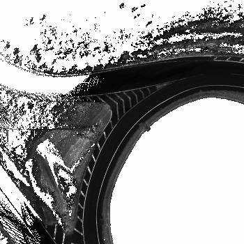
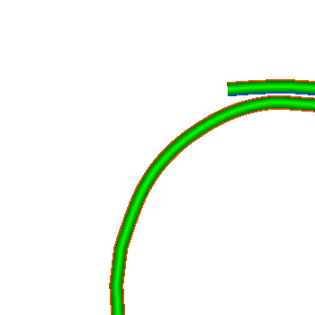

# Road Mapper Module

## Description

The Road Mapper module defines a new  

## Rules for groundtruth annotations on remission map images

1. Use [**Inkscape**](https://inkscape.org/en/download) to draw a polyline all the way along the center of each road lane.
2. Place both the start and finish points out of the image limits, in order to provide a better fit for each polyline.
3. Place the start point of each polyline in such a way that lane orientation matches the direction from the start point to the finish point.
4. If two polylines either cross, merge or fork, then make sure to draw the *"main"* polyline before the secondary. 
5. Make each point of the polyline auto-smooth, in order to generate a cubic Bezier curve.
6. Set each polyline stroke width properly, in order to fulfill each road lane and touch the borders of the neighbor lanes.
7. Select each line stroke paint color according to the following code:
	-  RGB(255, 000, 000) = #ff0000 = single line marking on both lane sides.
	-  RGB(255, 000, 127) = #ff007f = single line marking on the right side and broken line marking on the left side.
	-  RGB(127, 000, 255) = #7f00ff = broken line marking on the right side and single line marking on the left side.
	-  RGB(000, 000, 255) = #0000ff = broken line marking on both lane sides.
	-  RGB(000, 255, 000) = #00ff00 = no line marking on both lane sides
	-  RGB(255, 127, 000) = #ff7f00 = single line marking on the right side and no line marking on the left side.
	-  RGB(127, 255, 000) = #7fff00 = no line marking on the right side and single line marking on the left side.
	-  RGB(000, 127, 255) = #007fff = broken line marking on the right side and no line marking on the left side.
	-  RGB(000, 255, 127) = #00ff7f = no line marking on the right side and broken line marking on the left side.
8. Save the Inkscape SVG file with same image name.

### Examples:

|Image Name|Remission Map | Ground Truth|Road Map |
|-----------------------|--------------|-------------|--------------|
|i7705600_-338380.png||||
|i7726110_-353570.png||||

 R.Carneiro:	from i7726530_-353710.png to i7758030_-363790.png
 
 R.Nascimento:	from i7705530_-338310.png to i7726460_-353990.png

**For more information look in docs/**

